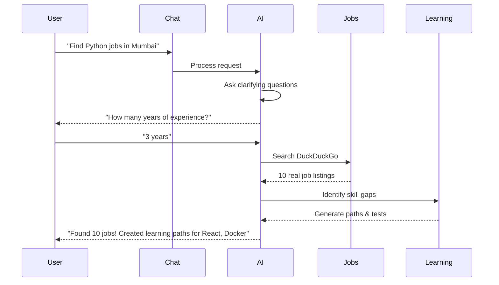

# Job Agent - AI-Powered Career Assistant

<div align="center">


**Complete AI-driven job search platform with real-time job discovery, automated learning paths, skill assessments, and intelligent career guidance.**

[Features](#-features) • [Quick Start](#-quick-start) • [Documentation](#-documentation) • [Deploy](#-deployment) • [Contributing](#-contributing)

</div>

---

## ✨ Features

### 🤖 Conversational AI Agent
- Interactive chat that asks clarifying questions
- Natural language job search
- Context-aware responses
- Multi-turn conversations

### 🌐 Real Job Search
- Live jobs from DuckDuckGo web search
- Direct application links to company websites
- Real interview opportunities
- No dummy data - actual job portals

### 📚 Auto Learning Paths
- AI-generated roadmaps based on skill gaps
- Curated learning resources
- Step-by-step milestones
- Interview preparation materials

### ✅ Skill Assessments
- Automated test generation
- Multiple-choice questions
- Detailed feedback with explanations
- Progress tracking

### 📊 Activity Tracking
- Monitor search history
- Track applications
- Test scores and progress
- Learning path completion

### 💼 Smart Job Board
- Curated opportunities matched to your profile
- External link indicators
- Application status tracking
- Salary information in ₹ Rupees

### 📄 Resume Analyzer
- AI-powered feedback
- Score from 0-100
- Specific improvement suggestions
- PDF upload support

---

## 🚀 Quick Start

### Prerequisites

- **Python** 3.8 or higher
- **Node.js** 16 or higher
- **Gemini API Key** - [Get one free](https://makersuite.google.com/app/apikey)

### Backend Setup

```bash
# Navigate to backend directory
cd backend

# Create virtual environment
python -m venv venv

# Activate virtual environment
# Windows:
venv\Scripts\activate
# Mac/Linux:
source venv/bin/activate

# Install dependencies
pip install -r requirements.txt

# Create environment file
copy .env.example .env  # Windows
# cp .env.example .env  # Mac/Linux

# Edit .env and add your GEMINI_API_KEY
# GEMINI_API_KEY=your_actual_api_key_here

# Start backend server
uvicorn main:app --reload --port 8000
```

Backend will be running at `http://localhost:8000`

### Frontend Setup

```bash
# Navigate to frontend directory
cd frontend

# Install dependencies
npm install

# Start development server
npm run dev
```

Frontend will be running at `http://localhost:5173`

### First Time Setup

1. Open `http://localhost:5173` in your browser
2. Navigate to Profile and complete your information
3. (Optional) Upload your resume for analysis
4. Start chatting with the AI!

---

## 📖 Documentation

Comprehensive guides are available in the `/docs` directory:

- **[Architecture Guide](./docs/ARCHITECTURE.md)** - System design and technical overview
- **[API Documentation](./docs/API.md)** - Complete REST API reference
- **[User Guide](./docs/USER_GUIDE.md)** - How to use the platform
- **[Deployment Guide](./DEPLOYMENT.md)** - Deploy to free hosting

---

## 🎯 How It Works



### User Journey

1. **Chat with AI**: "Find Python developer jobs in Mumbai"
2. **AI Clarifies**: Asks about experience, preferences
3. **Real Search**: Searches web for live opportunities
4. **Auto Learning**: Creates paths for missing skills
5. **Skill Tests**: Generates assessments
6. **Apply**: Direct links to company portals

---

## 🏗️ Tech Stack

### Frontend
- **React 18** - UI library
- **Vite** - Build tool
- **React Router** - Navigation
- **Framer Motion** - Animations
- **Axios** - HTTP client
- **Lucide React** - Icons

### Backend
- **FastAPI** - Web framework
- **Python 3.8+** - Programming language
- **SQLite** - Database
- **Pydantic** - Data validation
- **Uvicorn** - ASGI server

### AI & External Services
- **Google Gemini AI** - Natural language processing
- **DuckDuckGo Search** - Real-time job discovery
- **PyPDF** - Resume text extraction

---

## 📦 Deployment

Deploy to free hosting platforms:

### Frontend → Vercel (FREE)

```bash
# Push to GitHub
git push origin main

# Visit vercel.com
# Import repository
# Framework: Vite
# Root: frontend
# Deploy!
```

### Backend → Render (FREE)

```bash
# Visit render.com
# Create Web Service
# Root: backend
# Build: pip install -r requirements.txt
# Start: uvicorn main:app --host 0.0.0.0 --port $PORT
# Add GEMINI_API_KEY environment variable
# Deploy!
```

**Detailed instructions**: See [DEPLOYMENT.md](./DEPLOYMENT.md)

---

## 🔐 Environment Variables

### Backend (.env)

```bash
# Required
GEMINI_API_KEY=your_gemini_api_key_here

# Optional - Model Selection
COORDINATOR_MODEL=gemini-2.0-flash
SPECIALIST_MODEL=gemini-2.0-flash

# Optional - Production
FRONTEND_URL=https://your-frontend.vercel.app
```

### Frontend (.env)

```bash
# Optional - Production API URL
VITE_API_URL=https://your-api.onrender.com
```

---

## 🗂️ Project Structure

```
Job_Agent/
├── backend/
│   ├── agents/              # AI agents
│   │   ├── orchestrator.py  # Main routing agent
│   │   ├── job_search.py    # Job search agent
│   │   ├── skill_advisor.py # Skill assessment agent
│   │   ├── learning_agent.py # Learning path generator
│   │   └── resume_reviewer.py # Resume analyzer
│   ├── database.py          # SQLite database
│   ├── llm_engine.py        # Gemini AI integration
│   ├── main.py              # FastAPI application
│   └── requirements.txt     # Python dependencies
│
├── frontend/
│   ├── src/
│   │   ├── components/      # Reusable components
│   │   ├── pages/           # Page components
│   │   ├── App.jsx          # Main app component
│   │   └── main.jsx         # Entry point
│   ├── package.json         # Node dependencies
│   └── vite.config.js       # Vite configuration
│
├── docs/                    # Documentation
│   ├── ARCHITECTURE.md      # System architecture
│   ├── API.md               # API documentation
│   └── USER_GUIDE.md        # User manual
│
├── DEPLOYMENT.md            # Deployment guide
└── README.md                # This file
```

---

## 🤝 Contributing

Contributions are welcome! Here's how you can help:

### Reporting Bugs
1. Check if the issue already exists
2. Open a new issue with:
   - Clear title and description
   - Steps to reproduce
   - Expected vs actual behavior
   - Screenshots if applicable

### Suggesting Features
1. Open an issue with `[Feature Request]` prefix
2. Describe the feature and its benefits
3. Provide examples or mockups


### Development Guidelines
- Follow existing code style
- Add comments for complex logic
- Update documentation for new features
- Test thoroughly before submitting

---

## 🙏 Acknowledgments

- **Google Gemini AI** - Powering the intelligent features
- **DuckDuckGo** - Real-time job search data
- **React Community** - Excellent documentation and ecosystem
- **FastAPI** - Amazing Python web framework

---

## 🔗 Links

- **Live Demo**: [Coming Soon]
- **Documentation**: [/docs](./docs)
- **Issues**: [GitHub Issues](https://github.com/YOUR_USERNAME/Job_Agent/issues)
- **Discussions**: [GitHub Discussions](https://github.com/YOUR_USERNAME/Job_Agent/discussions)

---

## 📧 Contact

For questions or support:
- Open an issue on GitHub
- Check the [User Guide](./docs/USER_GUIDE.md)
- Review [API Documentation](./docs/API.md)

---

<div align="center">

**Made with ❤️ for job seekers everywhere**

⭐ Star this repo if you found it helpful!

</div>
