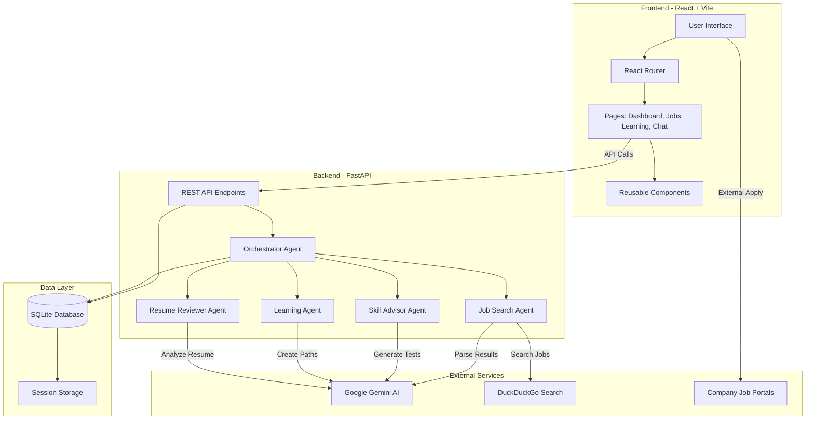

# System Architecture

## Overview

Job Agent is a full-stack AI-powered career assistant with a React frontend, FastAPI backend, and Google Gemini AI integration.



## Architecture Layers

### 1. Presentation Layer (Frontend)

**Technology**: React 18, Vite, Framer Motion

**Responsibilities**:
- User interface rendering
- Route management
- State management
- API communication
- Form handling
- Animations and transitions

**Key Components**:
- `App.jsx` - Main application and routing
- `Layout.jsx` - Navigation and theme management
- `ChatInterface.jsx` - Conversational AI interface
- Page components (Dashboard, Jobs, Learning, etc.)

### 2. API Layer (Backend)

**Technology**: FastAPI, Python 3.8+

**Responsibilities**:
- RESTful API endpoints
- Request validation
- Response formatting
- Error handling
- CORS management

**Endpoints**:
- `/api/chat` - Chat interactions
- `/api/jobs` - Job management
- `/api/tests` - Skill testing
- `/api/learning` - Learning paths
- `/api/profile` - User profile
- `/api/resume` - Resume analysis

### 3. Business Logic Layer (Agents)

**Technology**: Python, Google Gemini AI

**Orchestrator Pattern**:
The Orchestrator Agent routes requests to specialized agents:

1. **Job Search Agent**
   - Searches DuckDuckGo for real jobs
   - Parses HTML responses
   - Extracts job details
   - Returns structured data

2. **Skill Advisor Agent**
   - Analyzes skill gaps
   - Generates test questions
   - Provides learning recommendations

3. **Learning Agent**
   - Creates learning paths
   - Generates skill tests
   - Evaluates test submissions

4. **Resume Reviewer Agent**
   - Extracts text from PDF
   - Analyzes content
   - Provides feedback and scoring

### 4. Data Layer

**Technology**: SQLite

**Database Schema**:

```sql
-- User Profile
user_profile (id, name, email, role, location, skills, preferences)

-- Jobs
jobs (id, title, company, description, location, salary_range, requirements, status, application_details)

-- Resume Reviews
resume_reviews (id, score, feedback, timestamp)

-- Learning Paths
learning_paths (id, data, timestamp)

-- Chat Sessions
chat_sessions (id, title, messages, created_at, updated_at)

-- Skill Tests
skill_tests (id, skill_name, difficulty, questions, created_at, job_related_ids)

-- Test Results
test_results (id, test_id, score, total_questions, answers, feedback, taken_at, time_taken_seconds)

-- User Activity
user_activity (id, activity_type, activity_data, timestamp)
```

## Data Flow

### Job Search Flow

```
User: "Find Python jobs in Mumbai"
    ↓
Frontend (ChatInterface)
    ↓
POST /api/chat
    ↓
Orchestrator Agent
    ↓
Job Search Agent
    ↓
DuckDuckGo API
    ↓
Parse Results → Gemini AI
    ↓
Save to Database
    ↓
Auto-generate Learning Paths
    ↓
Auto-generate Skill Tests
    ↓
Return Response
    ↓
Frontend Updates (Job Board)
```

### Skill Test Flow

```
User: Clicks "Take Test"
    ↓
Navigate to /test/:testId
    ↓
GET /api/tests/:testId
    ↓
Display Questions
    ↓
User Submits Answers
    ↓
POST /api/tests/:testId/submit
    ↓
Learning Agent evaluates
    ↓
Save results to database
    ↓
Display feedback
```

## AI Integration

### Google Gemini Usage

1. **Intent Recognition**
   - Route user messages to correct agent
   - Extract parameters (location, role, etc.)

2. **Content Generation**
   - Create learning paths
   - Generate test questions
   - Write explanations

3. **Natural Language Processing**
   - Parse job requirements
   - Analyze resumes
   - Understand user queries

### Prompting Strategy

- **System Prompts**: Define agent roles and capabilities
- **Context**: Include chat history and user profile
- **JSON Responses**: Structured output for consistency
- **Fallbacks**: Default responses if AI fails

## Security Architecture

### Authentication (Future Enhancement)
Currently uses single-user mode. For multi-user:
- JWT tokens
- OAuth2 integration
- Session management

### Data Protection
- Environment variables for secrets
- No API keys in code
- Secure CORS configuration
- Input validation

### External Links
- `rel="noopener noreferrer"` for security
- Direct to company websites
- No data sent to external sites

## Scalability Considerations

### Current Limitations
- Single SQLite database
- In-memory session storage
- Synchronous AI calls

### Future Enhancements
1. **Database**: Migrate to PostgreSQL
2. **Caching**: Redis for session/API responses
3. **Queue**: Celery for async job processing
4. **CDN**: Static asset delivery
5. **Load Balancer**: Multiple backend instances

## Deployment Architecture

### Development
```
localhost:5173 (Frontend - Vite)
    ↓
localhost:8000 (Backend - Uvicorn)
    ↓
SQLite (Local file)
```

### Production
```
Vercel (Frontend CDN)
    ↓
Render/Railway (Backend API)
    ↓
PostgreSQL/Supabase (Database)
```

## Technology Choices

### Why React?
- Component reusability
- Large ecosystem
- Fast development
- Great developer experience

### Why FastAPI?
- Fast performance
- Auto API documentation
- Type safety with Pydantic
- Easy async support

### Why SQLite?
- Zero configuration
- Perfect for single-user
- Easy to migrate
- File-based portability

### Why Gemini AI?
- Free tier available
- Multimodal capabilities
- Fast response times
- Good instruction following

## Performance Optimization

### Frontend
- Code splitting by route
- Lazy loading images
- Memoized components
- Debounced search inputs

### Backend
- Database indexing
- Query optimization
- Response caching (future)
- Async endpoints (future)

### AI
- Prompt caching
- Batch requests (future)
- Response streaming (future)

## Monitoring & Logging

### Current
- Console errors (development)
- API response codes
- Database error handling

### Recommended for Production
- **Sentry**: Error tracking
- **LogRocket**: Session replay
- **Google Analytics**: Usage metrics
- **Uptime Robot**: Service monitoring

---

**Last Updated**: 2025-11-25
**Version**: 1.0.0
